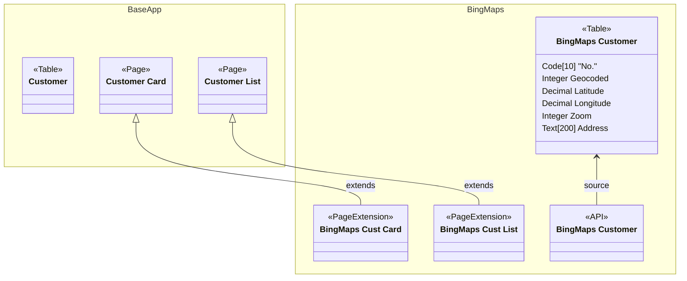

BingMaps.AppSource is a powerful and easy-to-use app that integrates Bing Maps with Microsoft Dynamics 365 Business Central. With this app, you can geocode your customers' addresses, view their locations on a map, and get directions to their places. You can also see all your customers in one collected view on Bing Maps, and filter them by different criteria. Whether you need to plan your sales visits, optimize your delivery routes, or analyze your market potential, BingMaps.AppSource can help you do it faster and smarter.

BingMaps.AppSource is an open source app that is developed by Microsoft and the community. You can contribute to the app by forking the repository¹, making your modifications, and submitting a pull request. You can also report any issues or suggestions on GitHub². BingMaps.AppSource is available in Denmark, Germany, Italy, and United States, and supports the Essentials and Premium Editions of Microsoft Dynamics 365 Business Central.

BingMaps.AppSource is designed to work seamlessly with Microsoft software like Power BI, SharePoint, and Office, as well as third-party tools. You can use Bing Maps to visualize your data in different ways, such as heat maps, cluster maps, or pushpins. You can also customize your map with different styles, layers, and labels. Bing Maps offers high-quality imagery, accurate geocoding, and reliable directions for over 190 countries.

BingMaps.AppSource is a must-have app for any business that wants to leverage the power of location data and Bing Maps. It is easy to install, configure, and use. You can get it now from Microsoft AppSource³ for free. Try it today and see how BingMaps.AppSource can help you grow your business.

1) microsoft/bcsamples-bingmaps.appsource - GitHub. https://github.com/microsoft/bcsamples-bingmaps.appsource.
2) Find the right app | Microsoft AppSource. https://appsource.microsoft.com/en-in/product/dynamics-365-business-central/PUBID.microsoftdynsmb%7CAID.bingmapsintegration%7CPAPPID.4270bff7-c860-434f-b09a-0f3e37d243fd.
3) microsoft/bcsamples-bingmaps.pte - GitHub. https://github.com/microsoft/bcsamples-bingmaps.pte.
4) Mapping Solution for Enterprise | Try Bing Maps Today. https://www.microsoft.com/en-us/maps/bing-maps/licensing/bing-maps-for-enterprise.

#### BingMaps Diagram

